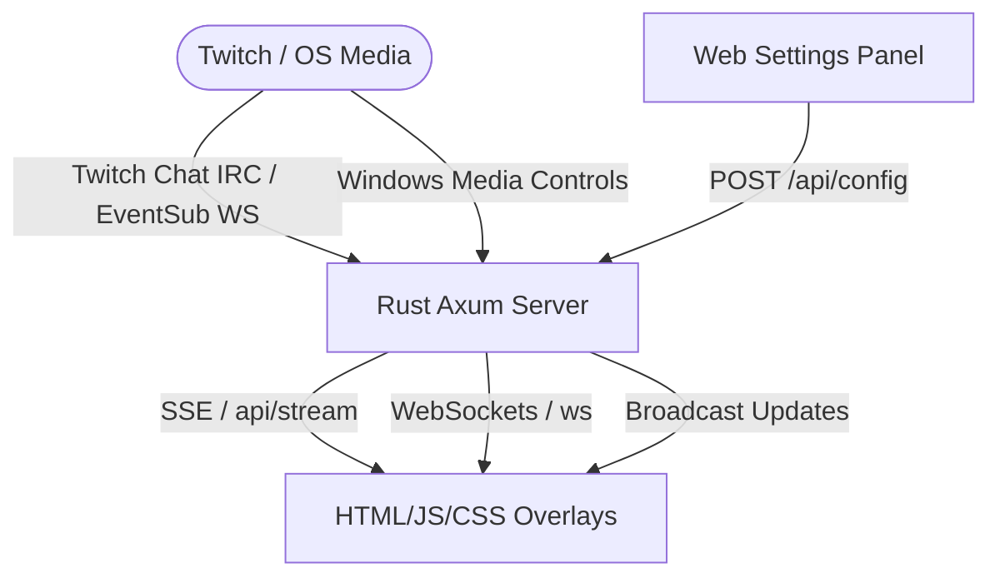

# Nova Live Suite - Dashboard & OBS Overlays

Nova Live Suite is a lightweight, high-performance local dashboard and OBS overlay system built in **Rust (Axum)** and modern vanilla front-end technologies. It runs directly on your Windows machine, integrating Twitch Chat (IRC), Twitch EventSub WebSockets (Alerts), Windows System Media Controls (Now Playing), and a Sponsor/Ad Carousel.

## 🚀 Features

*   **Cozy Twitch Chat Overlay**: Modern CSS glassmorphic messages with customizable alignment, fade times, message limits, and Twitch Broadcaster/Moderator/Subscriber badge rendering.
*   **Live Now Playing Widget**: Displays current playing song, artist, album art, and real-time audio visualizer.
    *   **Hide on Alert**: Can automatically hide during Twitch alerts for a configurable or forced duration (default 6.5s) to avoid screen overlap.
*   **Twitch EventSub Alerts**: Animated cards, images, custom sounds, and layouts for Follows, Subscriptions, and Raids.
*   **Sponsor Carousel**: Rotates sponsor/partner images, videos, or webpages using customizable transitions (fade, slide, zoom) and durations.
*   **System Tray Integration**: Native Windows system tray icon with autostart registry configuration.
*   **Web Dashboard**: Fully interactive preview panel to manage all styling settings (font sizes, colors, margins) in real time with import/export tools.

---

## 🛠️ Architecture



1.  **Axum Backend (`src/main.rs`)**:
    *   Serves assets, templates, and dynamic API endpoints (under `http://127.0.0.1:777`).
    *   Funnels all Twitch activity and system media state changes to connected overlays using Server-Sent Events (SSE) `/api/stream` and WebSocket connections.
2.  **HTML/JS/CSS Client Overlays (`/overlays/*`)**:
    *   **`chat.html`**: Cozy, stylized Twitch chat box.
    *   **`nowplaying.html`, `nowplaying.js`, `nowplaying.css`**: Live track widget.
    *   **`carousel.html`**: Rotator for sponsors.
    *   **`alerts.html`, `alerts.js`, `alerts.css`**: Interactive overlay card system.

---

## ⚙️ Configuration & Customization

The settings are saved in a local `config.json` file in the application directory.

### Key Configuration Structs:
*   `ChatSettings`: Handles dimensions, font family/sizes, shadow effects, padding, layout alignment, and stay duration.
*   `NowPlayingSettings`: Manages media player source filters (Spotify, Chrome, Firefox, System), lyrics toggling, audio visualizers, themes, and "hide on alert" settings.
*   `AlertSettings`: Sets custom templates, image/sound upload links, alert display duration, and entry/exit animation styles.
*   `CarouselSettings`: Configures items rotation list, layout dimensions, transition types, and background blending.

---

## 💻 OBS Setup Guide

To integrate any overlay in OBS Studio:
1. Add a new **Browser Source** in your OBS scene.
2. Set the URL to the corresponding overlay address:
   *   **Twitch Chat**: `http://127.0.0.1:777/overlays/chat`
   *   **Now Playing**: `http://127.0.0.1:777/overlays/nowplaying`
   *   **Sponsors Carousel**: `http://127.0.0.1:777/overlays/carousel`
   *   **Twitch Alerts**: `http://127.0.0.1:777/overlays/alerts`
3. Configure the dimensions (Width/Height) in OBS based on your settings.
4. Check **Refresh browser when scene becomes active** (recommended).

---

## ⚡ Developer & Build Instructions

### Prerequisites
*   [Rust/Cargo](https://rustup.rs/) (edition 2024)
*   Windows OS (for media parsing APIs)

### Building the Application (Release Mode)
To compile a highly optimized, minimized binary executable, run:
```bash
cargo build --release
```

### Compiler Size Optimizations Active:
The project uses advanced cargo flags in `Cargo.toml` to minimize compilation and storage footprints:
*   `opt-level = "z"`: Optimizes the build aggressively for binary size rather than compilation speed.
*   `lto = true`: Link-Time Optimization merges crates into a unified module to eliminate unused code paths.
*   `codegen-units = 1`: Aggregates code units to ensure the optimizer has full visibility of dependencies.
*   `panic = "abort"`: Removes stack unwinding code, reducing the binary footprint.
*   `strip = true`: Automatically strips symbol maps and debugging tables from the compiled `.exe`.

### Execution
Run the compiled executable:
```bash
.\target\release\OverlayDashboardRust.exe
```
This runs the background server and spawns a system tray icon. Access the local configuration dashboard at `http://127.0.0.1:777`.
